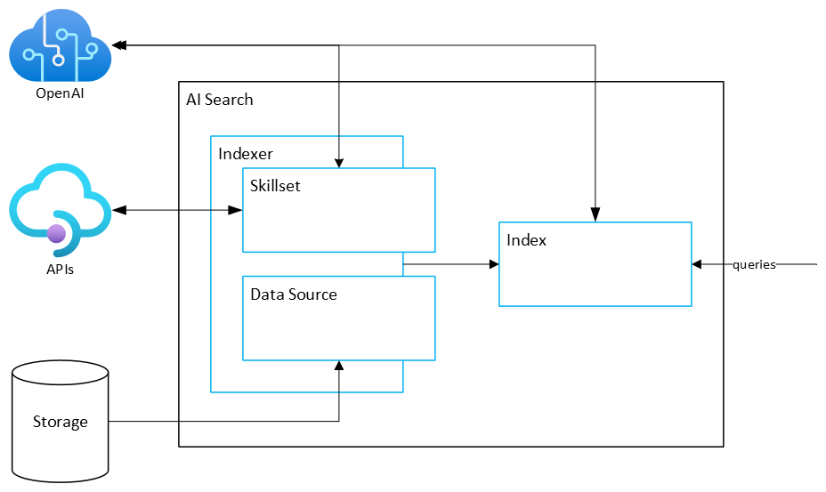
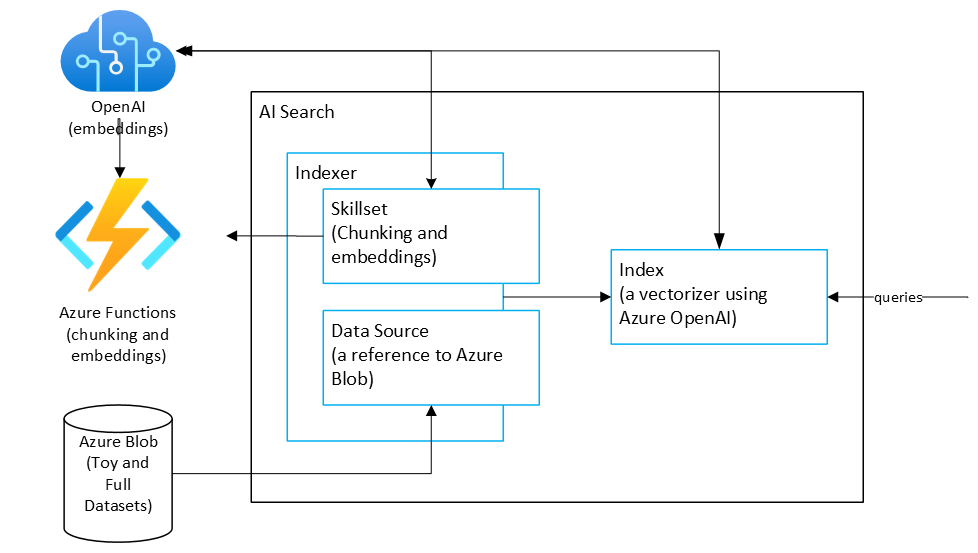
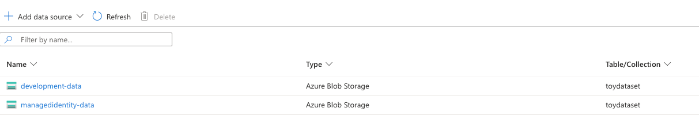
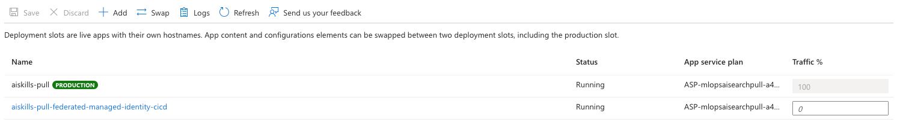
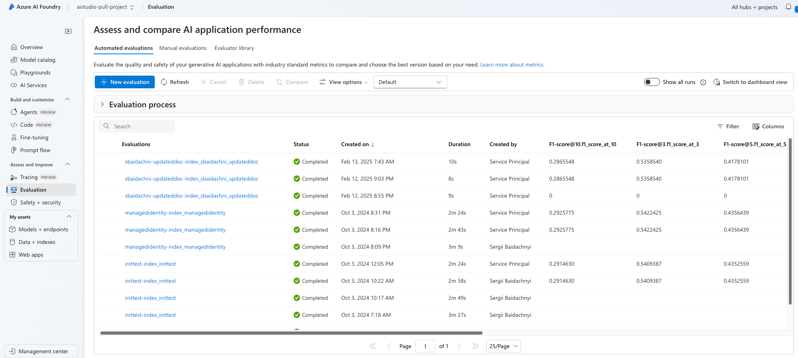
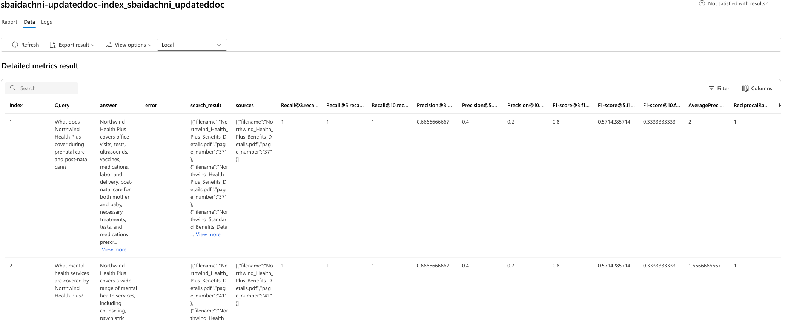
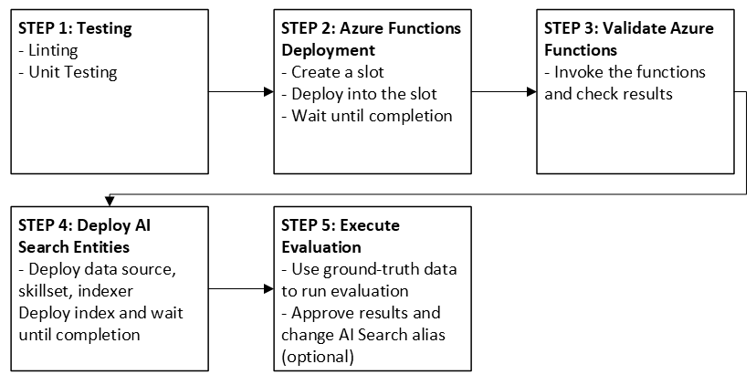
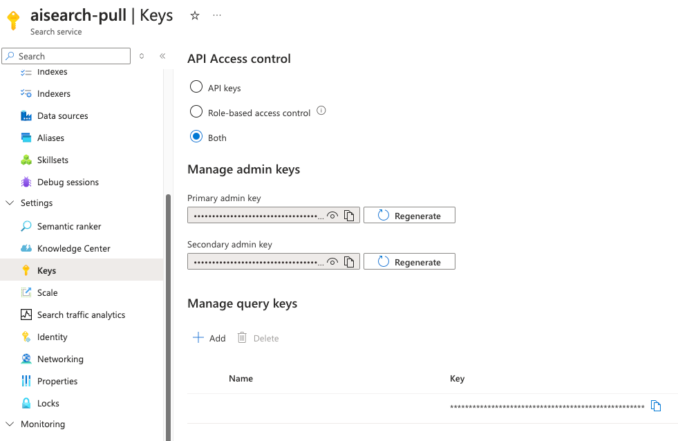

# MLOps Template for Azure AI Search: Pull approach

This repository demonstrates how to implement a Machine Learning Development and Operations (MLOps) process for [Azure AI Search](https://learn.microsoft.com/en-us/azure/search/) applications that use a [pull model](https://learn.microsoft.com/en-us/azure/search/search-what-is-data-import#pulling-data-into-an-index) to index data. It creates an indexer with two custom skills that pull pdf documents from a blob storage container, chunks them, creates embeddings for the chunks and then adds the chunks into an index. Finally, it performs search evaluation for a collection of data and uploads the results to an [Azure AI Foundry](https://learn.microsoft.com/en-us/azure/ai-studio/) project so that evaluations can be compared across multiple runs to continue improving the custom skills.

## Technical Requirements

- [Azure AI Search](https://learn.microsoft.com/en-us/azure/search/)
- [Azure OpenAI](https://learn.microsoft.com/en-us/azure/ai-services/openai/overview)
- [Azure AI Foundry](https://learn.microsoft.com/en-us/azure/ai-studio/) project
- [Azure Function App](https://learn.microsoft.com/en-us/azure/azure-functions/)
  - For the best performance of the skillset functions and slot deployments, it is recommended to use an App Service Plan with a level of at least `Standard S3`
- Azure Storage Account

## Technological stack

Azure AI Search is the recommended retrieval system for building RAG-based applications on Azure. Its indexing capabilities allow AI Search to interact with Azure OpenAI Service and implement custom workloads that prepare data for search queries and handle data updates. In other words, a data processing pipeline can be implemented and deployed as part of AI Search, and the service will automatically pull data, run the preprocessing pipeline according to the provided indexer, and manage updates.

The primary components that should be developed as part of an indexing pipeline include skillset, data source, indexer, and index. A **data source** specifies everything about incoming data, including policies for deletion and updating data. A **skillset** is a collection of one or more skills, where each skill is a step in the processing pipeline, and each step can be custom or predefined. For custom skills, it is necessary to deploy and reference an external web service (such as Azure Functions) in the skill. An **indexer** combines a data source, skillset, and field mapping for both input and output data, providing everything needed to process and send data into an **index**. An index is linked to output data, and queries need an index to get results.


 
After obtaining an indexer, index, and associated components, they can be deployed with the AI Search API. Then, wait until the indexer preprocesses the data before starting to send queries to the index.

In RAG-based applications, accurate data retrieval is crucial. If it fails, LLM-based applications querying the data will also fail. This exemplifies "garbage in – garbage out". Thus, a high-quality processing pipeline is essential, requiring time, iterations, and experiments to develop.

The [https://github.com/microsoft/mlops-aisearch-pull](https://github.com/microsoft/mlops-aisearch-pull) repository shows how to implement development and operations processes using Azure AI Search, Azure OpenAI, Azure Functions, and Azure Storage. It covers LLMOps for data retrieval and LLM-based application services.

*Note. The [https://github.com/microsoft/mlops-llm-application-service](https://github.com/microsoft/mlops-llm-application-service) repository demonstrates LLMOps for an LLM application service.*

We are using the following architecture for the template:



In the repository we are using a data processing pipeline with two custom skills for chunking and embedding. This adds complexity to the indexer deployment, which is typical for real projects. The data is stored in Azure Blob within the Azure Storage service.

## Testing strategy and best practices

Testing and Evaluation is essential for LLMOps in data retrieval, necessitating the deployment of AI Search indexes and indexers to calculate metrics. The process becomes increasingly complex as LLMOps must facilitate a team's ability to experiment with indexing, allowing each engineer to conduct their own experiments concurrently. AI Search entities should differ across experiments. Let us discuss how experimentation process can be for all components of the data processing pipeline.

Data processing pipelines need access to **input data** via a **data source** entity. Generally, engineers can use the same data for all experiments, but large datasets can slow down experimentation and increase costs. To mitigate this, create a smaller subset, known as a **toy dataset**, for local testing and validation before merging code into the main branch. Since a data source is merely a reference to actual data, a new data source can be utilized for each experiment. The main consideration is naming the entities. It is advisable to include the **feature branch name** as part of the naming convention. For instance, the screen displayed below illustrates two data sources. One data source was created to experiment with indexing in the managedidentity branch, while the other was established for the development branch.


 
A consistent naming convention can be applied to all AI Search entities, including indexes, indexers, and skillsets. The **naming_utils.py** file within the template provides all necessary methods to generate names throughout the template.

Azure AI Search provides support for both SDK and REST API, which simplifies the creation of indexing components. For example, **build_indexer.py** includes the methods for supported examples, while **cleanup_pr.py** allows for the deletion of resources after a successful merge. Ensuring the cleanup of resources is part of the merging strategy is important, as AI Search supports a fixed number of indexes.

The deployment of **custom skills** poses a unique challenge in data processing pipeline experiments, primarily because these skills leverage external web APIs that may be modified during experimentation. Our current scenario involves the deployment of two Azure Functions in a way that ensures ongoing experiments are not disrupted. To achieve this, we propose utilizing **Deployment Slots** in Azure Functions which allow multiple deployments using the same resources for testing purposes. The image below illustrates a deployment configuration being utilized for the development environment (branch) alongside an additional deployment created for experiments within the federated-managed-identity-cicd branch.


 
Each deployment contains functions that we are using in the indexing process, and we can reference the functions using the slot name in the skillset itself. The deploy_azure_functions.py file contains all needed methods to demonstrate a way to deploy Azure Functions from code.

> **Note on deployment slots**: Deployment slots are only available on **Standard, Premium, and Dedicated App Service plans** — they are not supported on Consumption or Flex Consumption plans. For this reason, the current CI workflows use `--ignore_slot` to deploy directly to the main function app. The code still supports slot-based deployments (the default when `--ignore_slot` is omitted), and engineers who are on a supported plan can take advantage of slots for parallel experimentation. If slots are not available on your plan, each engineer working in parallel should use their **own dedicated Azure Function App** to avoid overwriting each other's deployments during active experiments.

Once all associated APIs, skillsets, indexes, data sources, and indexers are deployed, the SDK can be used to wait until the indexing process is completed. At that point, evaluation can begin.

To illustrate the evaluation process, we utilize the Azure AI Evaluation SDK. This tool allows for the execution of complex evaluations either locally or through serverless computing in AI Foundry. Additionally, evaluation results can be published to AI Foundry. The **search_evaluation.py** script provides guidance on setting up the evaluation process using various custom evaluators. It also includes instructions on querying AI Search for data and details on publishing evaluation results to AI Foundry. The following image demonstrates several evaluation results, and it’s possible to note that branch names have been utilized there as well.


 
The proposed approach enables engineers to conduct their experiments and compare results across different iterations. Additionally, AI Foundry provides the capability to view results on a per-row basis.

 

Based on the evaluation results you can decide about next steps like packaging existing code into an artifact, change the alias of the development index to reference the new name or any other actions. Of course, it makes sense in the development, qa or production environments where you are using the full dataset.

Therefore, Testing and Evaluation flow contains the following steps:



All these steps have been implemented as a part of GitHub workflows and can be found in **ai_pull_pr_workflow.yml**.

## Security considerations

The repository illustrates how to operate in a keyless environment without storing access keys for Azure OpenAI, Azure Storage, or AI Search. When code is executed locally, the engineer's credentials can be used. However, in cloud environments, components must interact with each other without direct user involvement. We have at least three places where some security techniques should be applied:

-	**GitHub Actions**: Azure supports OpenID Connect (OIDC) Federated Credentials that can be associated with a user managed identity in Azure and a repository action in GitHub. Thanks to that you can have an entity with needed credentials that GitHub can use with no keys. The following [document](./docs/federated_identity_openid_connect.md) demonstrates how to setup this kind of credentials.
-	**Azure Functions**: We are using Azure Functions to get access to resources like Azure Blob and Azure OpenAI. Rather than storing keys in the application settings for Azure Functions we utilize user-assigned managed identity. You can find more details visiting this [link](./docs/durable_azurefunction_deployment.md).
-	**AI Search**: index and data source entities should have access to data (Azure Blob in our case) and Azure OpenAI for data processing. In this template we demonstrate how to use system assigned managed identity avoid storing keys directly. More details can be found [here](./docs/ai_search_system_identity.md).

This template uses **two separate identity client IDs** for different purposes:

- **`FEDERATED_CLIENT_ID`** — the Client ID of a **user-assigned managed identity or a Microsoft Entra application** configured in Azure AD. It is used exclusively by GitHub Actions to authenticate with Azure via OIDC. GitHub exchanges an OIDC token for a short-lived Azure access token using this identity, so no credentials are stored in GitHub secrets. Both a managed identity and a service principal (app registration) are supported for this purpose.
- **`MANAGED_IDENTITY_CLIENT_ID`** — the Client ID of a **user-assigned managed identity** that is attached to the Azure Function App and AI Search service. Code running inside the function app uses this identity to access Azure resources (Blob Storage, Azure OpenAI) without storing any keys.

These two identities serve different trust boundaries: one is for GitHub's CI/CD pipeline, and the other is for the deployed Azure services. In simpler setups it is possible to use a single identity for both purposes, provided the identity has all the required role assignments (Contributor access for deployment, plus resource-level roles for storage and OpenAI). Using separate identities is the recommended approach for least-privilege security.

In addition to providing documentation on the use of managed identities, it is important to note that Azure AI Search may require additional configurations to enable interaction with managed identities. To achieve this, navigate to the **Keys** tab and ensure that either **Role-based access control** or **Both** is selected.




## Folder Structure

Below are some key folders within the project:

- **src/custom_skills**: Contains the function app which has the chunking and embedding skillset functions used by the indexer
- **mlops**: Contains the scripts for implmenting MLOPs flows
- **config**: Configuration for the MLOPs scripts
- **data**: Sample data for testing the indexer
- **.github**: GitHub workflows that can be used to run an MLOPs pipeline
- **.devcontainer**: Contains a development container that can help you work with the repo and develop Azure functions

Additionally, the root folder contains some important files:

- **.env.sample**: The file should be renamed to `.env` and sensitive parameters (parameters that cannot be hardcodeded in `config.yaml`) should be populated here.
- **setup.cfg**: The repo uses strict rules to validate code quality using flake8. This file contains applied rules and exceptions.
- **requirements.txt**: This file lists all the packages that the repo is using.

## Local Execution

The deployment scripts and github workflows use the git branch name to create a unique naming scheme for all of the deployed entities.

### Configuration

- Create an `.env` file based on `.env.sample` and populate the appropriate values. The `AI_FOUNDRY_PROJECT_URI` value should follow the format `https://<ai_foundry_name>.services.ai.azure.com/api/projects/<project_name>`.
- Modify `config/config.yaml` to meet any changes that have been made within the project. The `function_app_name` is read from the `FUNCTION_APP_NAME` environment variable. To disable anonymous telemetry, remove the `enable_telemetry` key from `config/config.yaml`.

### Upload test data

Sample pdfs are available in `data` to use for indexer testing.  To upload the data to blob storage, use the following:

```sh
python -m mlops.deployment_scripts.upload_data
```

### Deploy Skillset Functions

The following deployment script will deploy the custom skillset functions to a function app deployment slot and poll the functions until they are ready to be tested:

```sh
python -m mlops.deployment_scripts.deploy_azure_functions
```

To deploy directly to the main function app without using a deployment slot (as in CI builds), use the `--ignore_slot` flag:

```sh
python -m mlops.deployment_scripts.deploy_azure_functions --ignore_slot
```

To test the two skillset functions after they are deployed, run the following script:

```sh
python -m mlops.deployment_scripts.run_functions
```

More information aboud local development of skillset functions can be found in the [custom skills readme](./src/custom_skills/readme.md).

### Deploy Indexer

An indexer is composed for four entities: index, datasource, skillset, and indexer.  The configuration for each is defined by the files in `mlops/acs_config`. To deploy the indexer and commence indexing the data in blob storage, run the following:

```sh
python -m mlops.deployment_scripts.build_indexer
```

### Perform Search Evaluation

This will perform search evaluation and upload the result to the Azure AI Foundry project specified by `AI_FOUNDRY_PROJECT_URI`. For more information about evaluation, see the [search evaluation readme](/mlops/evaluation/readme.md).

```sh
python -m mlops.evaluation.search_evaluation --gt_path "./mlops/evaluation/data/search_evaluation_data.jsonl" --semantic_config my-semantic-config
```

### Cleanup Deployment

Since the git branch name was used to create the deployed entities, this deployment script will clean up everything by deleting the deployment slot in the function app and the indexer entities.

```sh
python -m mlops.deployment_scripts.cleanup_pr
```

## DevOps Pipelines

This project contains github workflows for PR validation and Continuous Integration (CI).

The PR workflow executes quality checks using flake8 and unit tests. It then deploys the skillset functions to a deployment slot of the function app.  Once the functions are deployed and tested, an indexer is deployed and all of the test data is ingested from blob storage.  Search evaluation is run, the results are uploaded to an Azure AI Foundry project, and a summary comment is posted on the pull request.

The CI workflow executes a similar workflow to the PR workflow, but the skillset functions are deployed to the main function app, not a deployment slot.

In order for the cleanup step of the CI Workflow to work correctly, the development branch from a pull request must not be deleted until the cleanup step has run.

### Container-based Workflow Execution

The PR and CI workflows (and the build validation workflow) run all job steps **inside a Docker container** pulled from an Azure Container Registry (ACR). This container image is pre-built with all Python dependencies, the Azure CLI, and any other tools required by the scripts, ensuring a consistent and fast execution environment.

The container image is defined in `.buildcontainer/Dockerfile` and is built and pushed to ACR automatically by the `build_devops_container.yml` workflow whenever `requirements.txt` or the Dockerfile changes. The `ACR_CONTAINER_REGISTRY` and `IMAGE_NAME` repository variables control which image is used at runtime.

Running jobs inside a container provides an important isolation benefit: without containerization, a workflow running on a self-hosted VM could inadvertently pick up environment variables, Python packages, or other libraries left over from a previous workflow run, leading to hard-to-debug inconsistencies. The container guarantees a clean, reproducible environment on every run.

**Self-hosted runners**: If you run these workflows on self-hosted machines rather than GitHub-hosted runners, the runner machine must have Docker installed and network access to the ACR. Make sure the runner can authenticate with the registry — the `ACR_USERNAME` and `ACR_PASSWORD` secrets are passed through to the container runtime for this purpose.

Some variables and secrets should be provided to execute the github workflows. The following **repository variables** (`vars.*`) are required:

- `SUBSCRIPTION_ID`
- `RESOURCE_GROUP_NAME`
- `STORAGE_ACCOUNT_NAME`
- `ACS_SERVICE_NAME`
- `AOAI_BASE_ENDPOINT`
- `AI_FOUNDRY_PROJECT_URI`
- `MANAGED_IDENTITY_CLIENT_ID`
- `MANAGED_IDENTITY_NAME`
- `MANAGED_IDENTITY_TENANT_ID`
- `FEDERATED_CLIENT_ID` — client ID of the Microsoft Entra application used by GitHub Actions to authenticate with Azure via OIDC (see [federated identity setup](./docs/federated_identity_openid_connect.md))
- `FUNCTION_APP_NAME` — name of the Azure Function App used for custom skills deployment
- `ACR_CONTAINER_REGISTRY` — Azure Container Registry name (without `.azurecr.io`) that hosts the DevOps container image
- `IMAGE_NAME` — name of the container image used in the workflows

The following **repository secrets** (`secrets.*`) are also required:

- `ACR_USERNAME` — username for authenticating with the Azure Container Registry
- `ACR_PASSWORD` — password for authenticating with the Azure Container Registry

## Contributing

This project welcomes contributions and suggestions.  Most contributions require you to agree to a
Contributor License Agreement (CLA) declaring that you have the right to, and actually do, grant us
the rights to use your contribution. For details, visit <https://cla.opensource.microsoft.com>.

When you submit a pull request, a CLA bot will automatically determine whether you need to provide
a CLA and decorate the PR appropriately (e.g., status check, comment). Simply follow the instructions
provided by the bot. You will only need to do this once across all repos using our CLA.

This project has adopted the [Microsoft Open Source Code of Conduct](https://opensource.microsoft.com/codeofconduct/).
For more information see the [Code of Conduct FAQ](https://opensource.microsoft.com/codeofconduct/faq/) or
contact [opencode@microsoft.com](mailto:opencode@microsoft.com) with any additional questions or comments.

## Data Collection

The software may collect information about you and your use of the software and send it to Microsoft. Microsoft may use this information to provide services and improve our products and services. You may turn off the telemetry as described below. There are also some features in the software that may enable you and Microsoft to collect data from users of your applications. If you use these features, you must comply with applicable law, including providing appropriate notices to users of your applications together with a copy of Microsoft’s privacy statement. Our privacy statement is located at [https://go.microsoft.com/fwlink/?LinkID=824704](https://go.microsoft.com/fwlink/?LinkID=824704). You can learn more about data collection and use in the help documentation and our privacy statement. Your use of the software operates as your consent to these practices.

The enable_telemetry configuration in config/config.yaml enables anonymous telemetry that helps us justify ongoing investment in maintaining and improving this template. Keeping this enabled supports the project and future feature development. To opt out of this telemetry, simply remove enable_telemetry.

## Trademarks

This project may contain trademarks or logos for projects, products, or services. Authorized use of Microsoft
trademarks or logos is subject to and must follow
[Microsoft's Trademark & Brand Guidelines](https://www.microsoft.com/en-us/legal/intellectualproperty/trademarks/usage/general).
Use of Microsoft trademarks or logos in modified versions of this project must not cause confusion or imply Microsoft sponsorship.
Any use of third-party trademarks or logos are subject to those third-party's policies.
