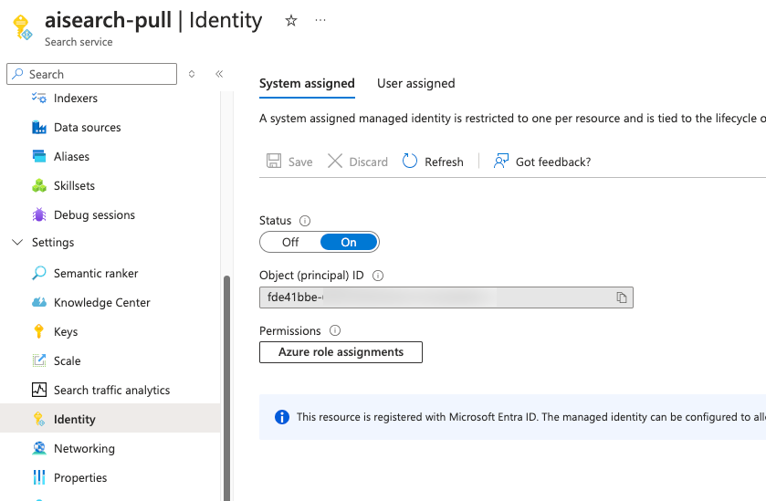
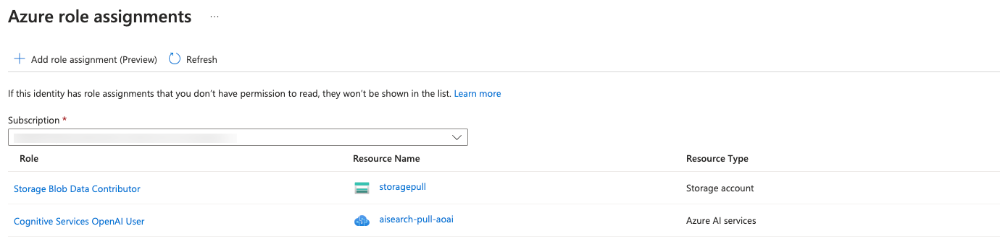

# AI Search System Assigned Managed Identity

To interact with data and the Azure OpenAI service, Azure AI Search can utilize connection strings and keys. However, as this approach is not secure, we recommend using either a system-assigned managed identity or a user-assigned managed identity. In this document, we will demonstrate how to set up a system-assigned managed identity.

The first step that should be done is activation System assigned managed identity. It can be done using the Identity tab:



After the system generates the identity, roles can be assigned to it. For this example, at least two roles are needed: Storage Blob Data Contributor (or at least Reader) for accessing the storage where the data is stored, and Cognitive Services OpenAI User to interact with Azure OpenAI models:


 
This concludes the instructions, and you may now proceed with building indexers and indexes without keys. For Azure OpenAI components, the key can be removed without requiring any other modifications. In the case of storage, it is necessary to modify the connection string using the following format:

```ResourceId=/subscriptions/{subscription_id}/resourceGroups/{resource_group_name}/providers/Microsoft.Storage/storageAccounts/{storage_account_name}```
